# Apex — Design Handoff & Spec Workspace

An interactive Design Spec Workspace and living Component Library built for the Apex SaaS Landing Page. This project bridges the gap between design specs and implementation code, providing frontend developers and designers with a real-time, interactive inspection and simulation panel.

---

## 📸 Project Showcase

Below is an organized collection of the design hub and its interactive states.
*(Place your captured screenshots in a folder named `screenshots/` at the root of the project to display them here)*

### 🖥️ Viewport Simulator & Responsiveness
| Desktop View (Hero) | Desktop View (Features) | Desktop View (CTA) |
| :---: | :---: | :---: |
|  | 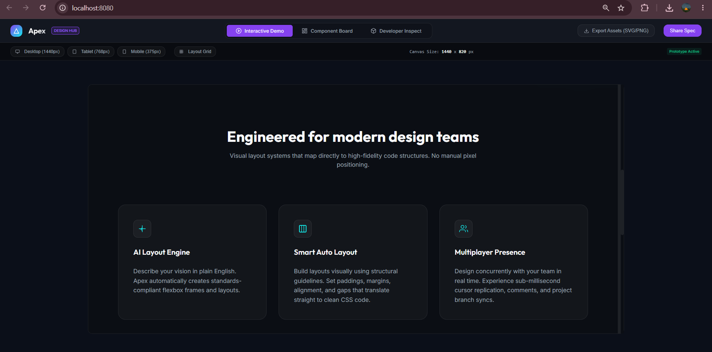 | 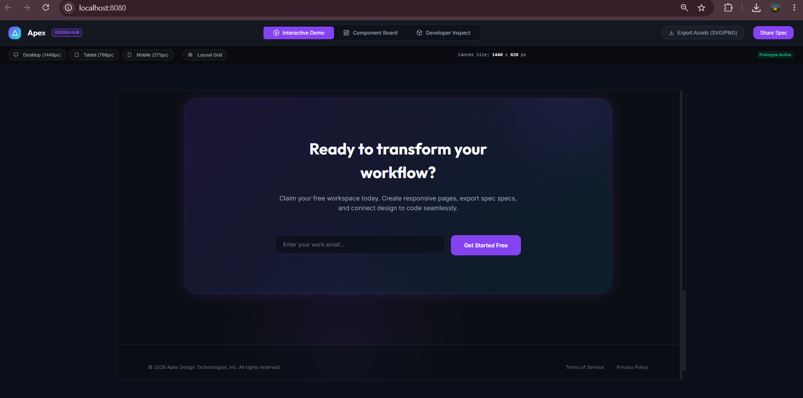 |

| Tablet View (768px) | Mobile View (375px) | Layout Grid (12-Col) |
| :---: | :---: | :---: |
|  | 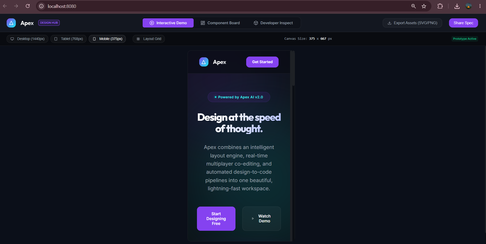 | 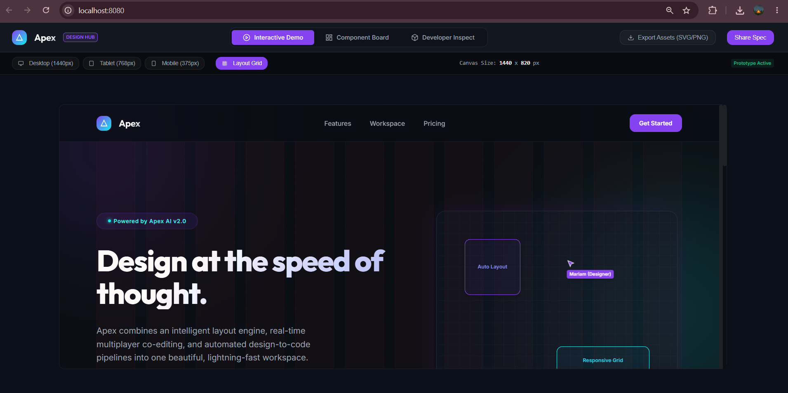 |

### 🚀 CTA Flow & Form Validation
| Email Format Error | Success Welcome Modal |
| :---: | :---: |
| 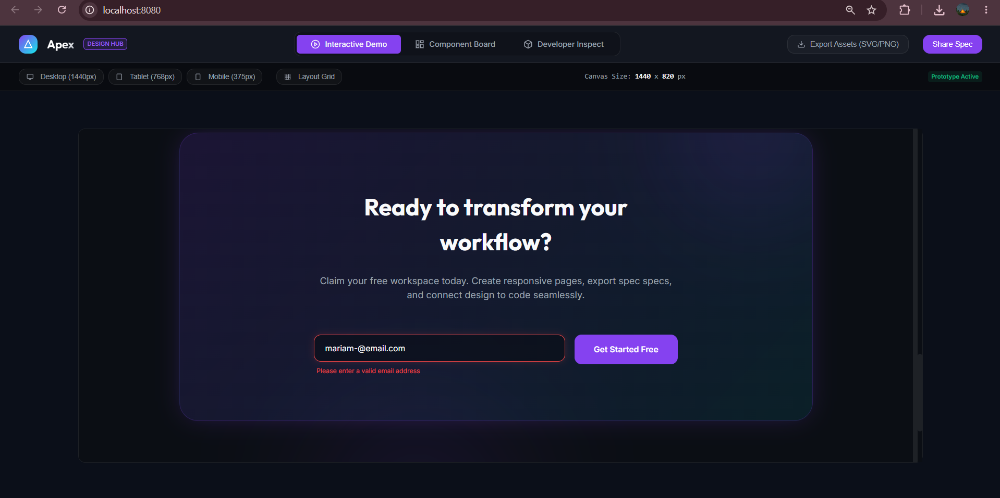 |  |

### 🧩 Component Board
| Components Overview | CSS Source Code Panel |
| :---: | :---: |
| 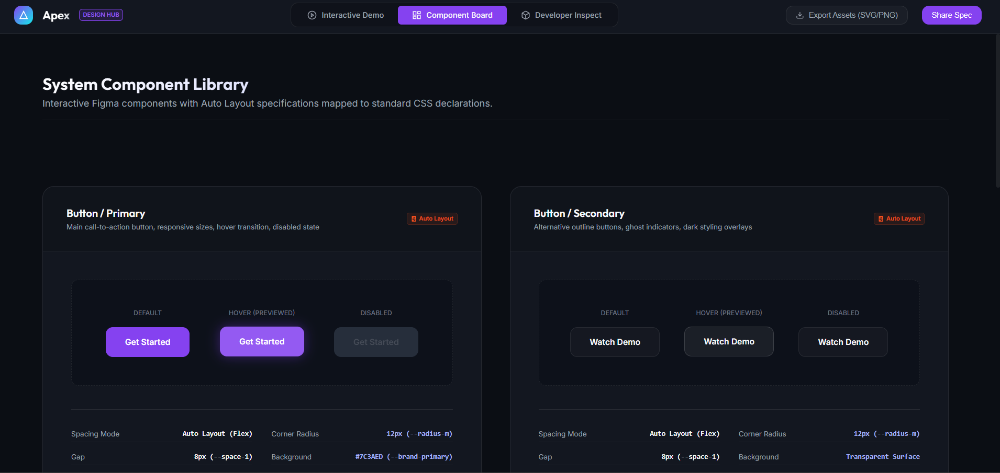 | 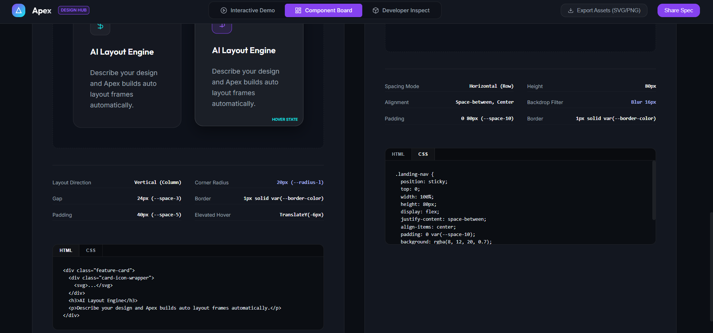 |

### 🔍 Developer Spec Inspector
| Left Tokens Sidebar | Swatch Clipboard Toast | Hover Outlines |
| :---: | :---: | :---: |
| 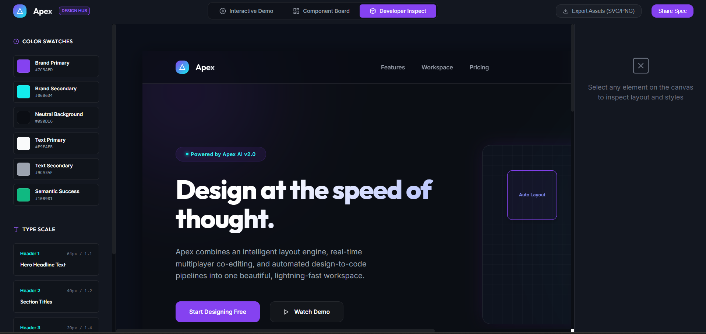 | 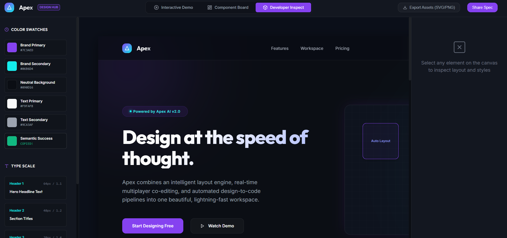 | 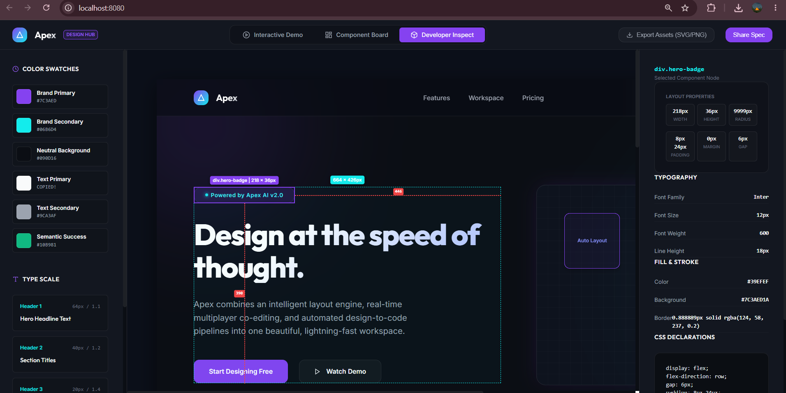 |

| Selection Outlines | Parent Spacing Guides | Code & Metrics Inspector |
| :---: | :---: | :---: |
| 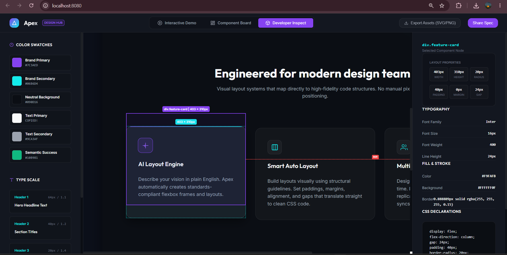 | 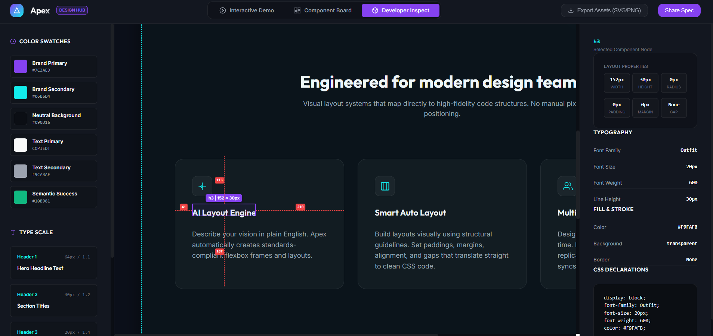 |  |

### 📦 Assets Export
| Asset Pack Dialogue |
| :---: |
| 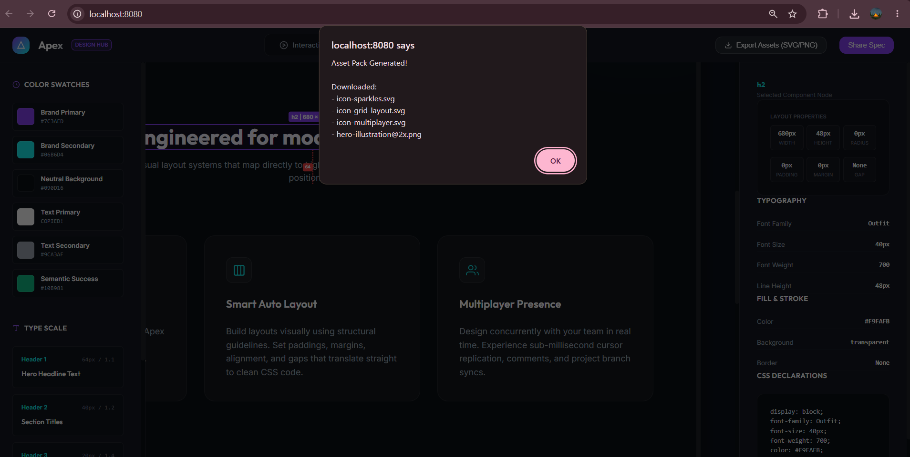 |

---

## 📋 Table of Contents
1. [Project Overview](#-project-overview)
2. [Key Features](#-key-features)
3. [Technology Stack](#-technology-stack)
4. [Design System & Tokens](#-design-system--tokens)
5. [Local Setup & Installation](#-local-setup--installation)
6. [Interactive Verification Checklist](#-interactive-verification-checklist)
7. [Author](#-author)

---

## 📖 Project Overview

Apex is an interactive workspace designed to demo and inspect high-fidelity web layouts. It features:
* **The Viewport Simulator** to test fluid layouts on desktop, tablet, and mobile grid containers.
* **A Live Component Library** showing HTML/CSS variants and spacing specs.
* **A Figma-like Element Inspector** that calculates computed layouts, paddings, margins, gaps, and absolute parent spacing offsets dynamically.

---

## 🌟 Key Features

### 1. Viewport Simulator
* Toggles canvas widths fluidly (`Desktop 100%`, `Tablet 768px`, `Mobile 375px`).
* Displays layout metrics (exact Canvas width x height).
* Includes a toggleable **Layout Grid columns overlay** matching Figma design setups.

### 2. Component Board
* Displays reusable components (Primary/Secondary Buttons, Feature Cards, Navigation Bars) under distinct layout variants.
* Interactive code tab switchers displaying copy-ready **HTML** and **CSS** source blocks.

### 3. Developer Spec Inspector
* **Spacing Guides**: Hovering or clicking elements renders real-time red dashed lines showing distance in pixels from the target element to its parent wrapper boundaries.
* **Box Model Specs**: Side panel reports parsed layout metrics including width, height, corner radius, padding, margin, and gaps.
* **Hex Color Translation**: Reads active runtime computed RGB/RGBA values and translates them into clean, standardized Hex values (`#RRGGBB` format) for easier handoffs.
* **Color Clipboard**: Clickable left sidebar swatches copy code values to the system clipboard with an animated confirmation indicator.

---

## 🛠️ Technology Stack

* **Structure**: HTML5 (Semantic markup, template-driven cloning)
* **Styling**: Vanilla CSS3 (Custom properties / variables, Flexbox layouts, Grid tracks, Container Queries for modular responsive scaling)
* **Logic**: Vanilla ES6+ Javascript (DOM querying, event bubbling, custom regular expression form validations)

---

## 🎨 Design System & Tokens

Our design is mapped to systematic CSS custom properties located in `styles/main.css`:

### Harmonious Colors
* **Brand Primary**: `#7C3AED` (Purple)
* **Brand Secondary**: `#06B6D4` (Cyan)
* **Background Dark**: `#090D16` (Deep space blue)
* **Card Surface**: `#111827` (Dark neutral gray)

### Typography Scales
* **Display Font**: *Outfit* (used for high-impact headlines)
* **Body Font**: *Inter* (used for clean, readable body paragraphs)
* **Scale**:
  * `--font-h1` (Hero Headings): `64px` / line-height `1.1`
  * `--font-h2` (Section Headers): `40px` / line-height `1.2`
  * `--font-h3` (Card Titles): `20px` / line-height `1.4`
  * `--font-body` (General Body Copy): `16px` / line-height `1.6`

---

## 🚀 Local Setup & Installation

Since the project consists of static assets, you do not need to compile or run builds. 

1. **Clone or Download** the project files to your system directory.
2. **Serve the project** using a local server to avoid template cloning or protocol issues:
   ```bash
   # Using NPM / NPX
   npx http-server -p 8080

   # Or using Python
   python -m http.server 8080
   ```
3. Open your browser and navigate to `http://localhost:8080`.

---

## 🧪 Interactive Verification Checklist

To make sure the project works perfectly, check the following flows:
1. **Interactive Demo**: Try switching between Desktop, Tablet, and Mobile viewport buttons. Ensure the dimensions indicator updates and the layout scales.
2. **CTA Form**: Enter an invalid email (e.g., `mariam-@email.com` or `invalid-email`) and click *Get Started Free* to verify the crimson error border. Enter a valid email (`mariam@email.com`) to display the welcome modal.
3. **Inspect Swatches**: Go to the *Developer Inspect* tab, click the swatches in the left sidebar, and paste (`Ctrl+V`) to verify they copied successfully.
4. **Canvas Inspection**: Click any header, button, or card inside the Inspect tab canvas. Verify that the spacing guides appear in red and the right panel populates with box-model metrics and compiled CSS code.

---

## ✍️ Author

**Mariam Gamal**  
*SyntecxHub Landing Page & Design Spec Workspace (Project 1)*
