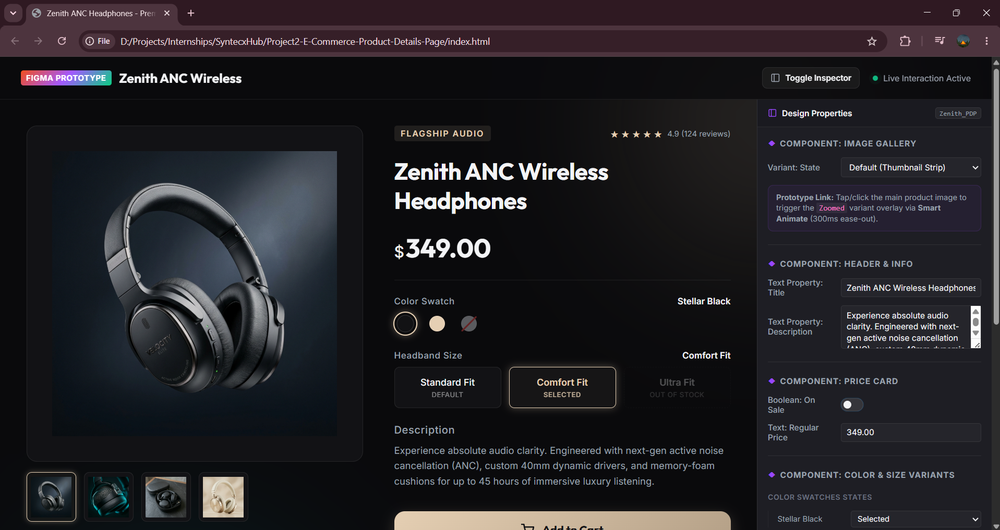
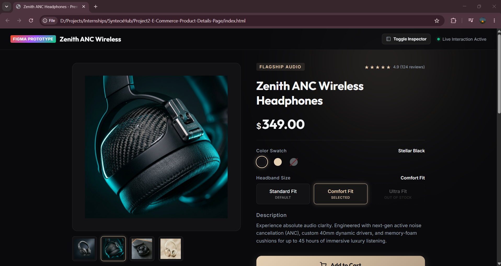
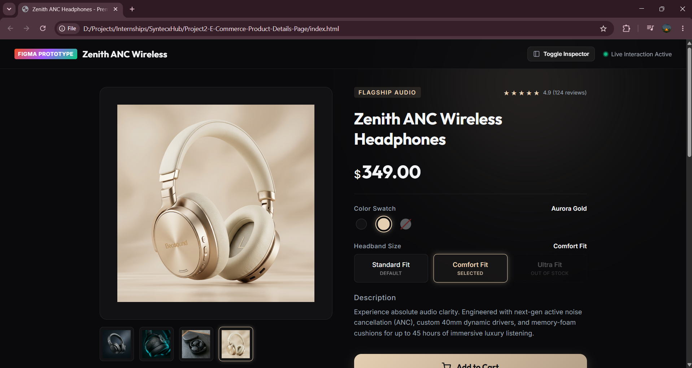
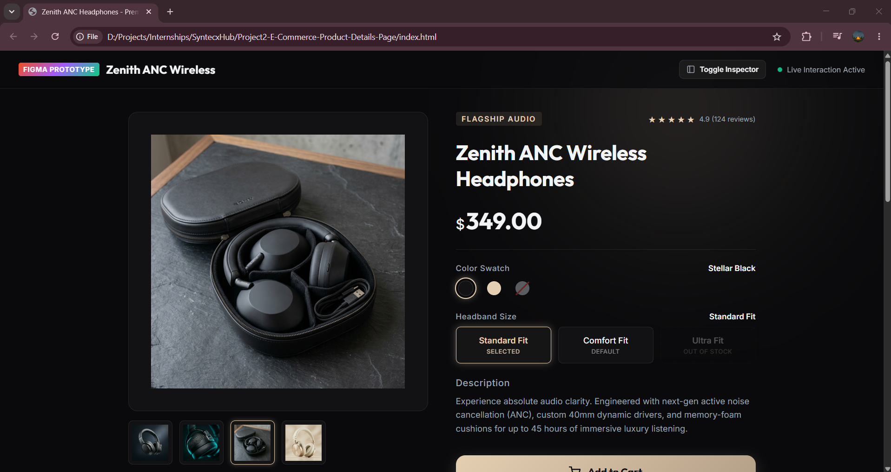
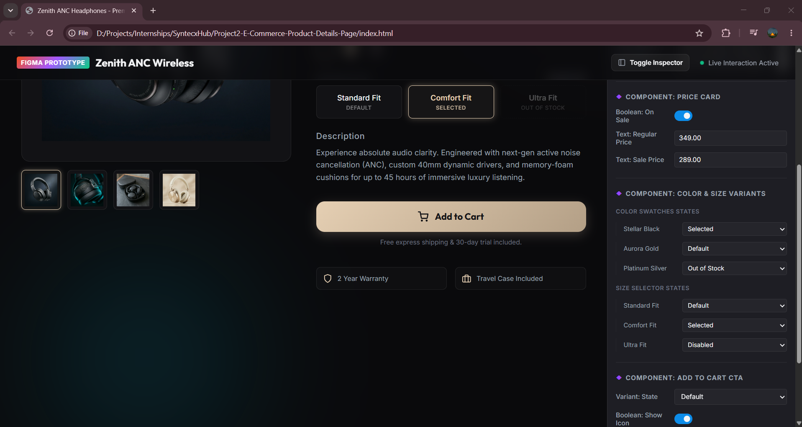
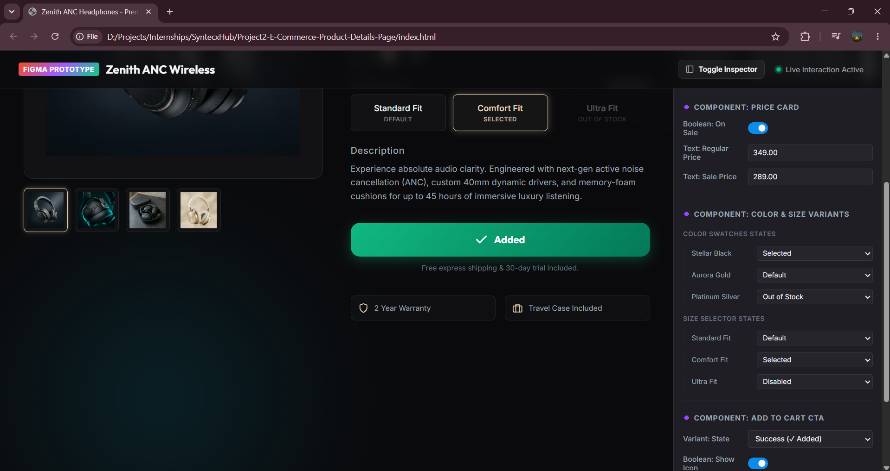
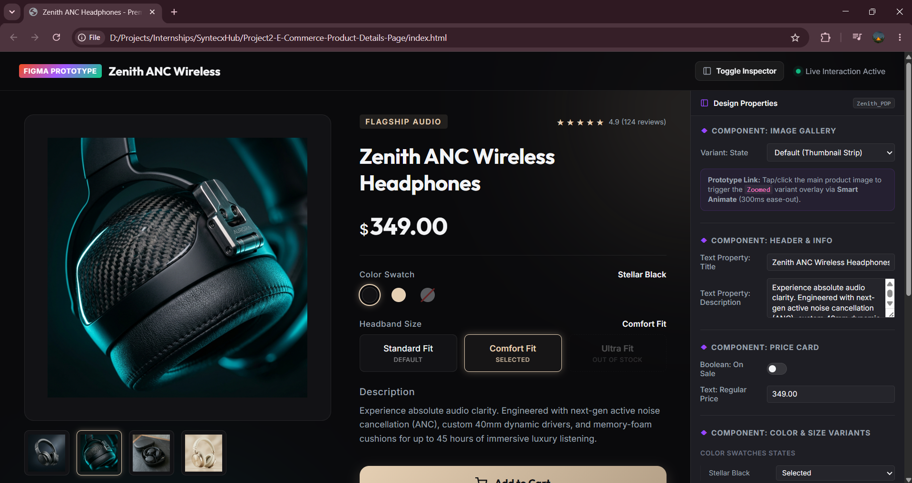
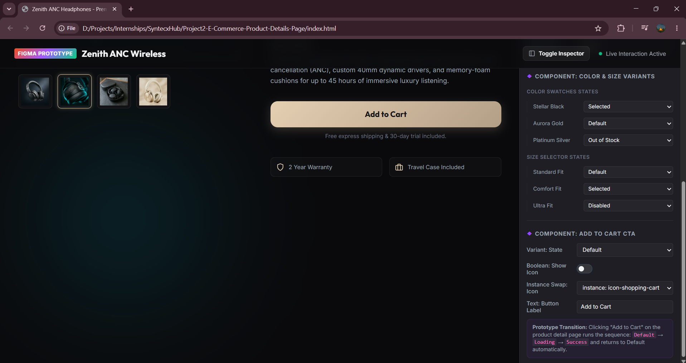

# Zenith ANC Headphones — Interactive Product Details Screen

An immersive, high-fidelity e-commerce Product Detail Page (PDP) simulation for a flagship luxury tech product (**Zenith ANC Wireless Headphones**). 

This project goes beyond a static page: it contains a **dual-view layout** featuring a conversion-optimized storefront on the left and a live **Figma Properties Inspector** simulator on the right. You can toggle component variants, inspect state changes (Default, Selected, Disabled, Out of Stock), test text/boolean properties, and trigger micro-interactions in real-time.

---

## 📸 Project Showcase & Screenshot Gallery

### 1. General Layout & Visual Hierarchy
The interface features a responsive two-column grid using a premium dark-themed aesthetic with neon cyan and warm gold highlights, glowing accents, and glassmorphic card surfaces.

#### Full Design Layout (Storefront + Figma Properties Panel)
*   **Filename**: `01_pdp_full_layout_dark.png`
*   **Description**: Displays the split screen with the responsive PDP on the left and the Figma inspector panel on the right.
*   **Preview**:
    

#### Clean Storefront View (Inspector Collapsed)
*   **Filename**: `02_pdp_storefront_view.png`
*   **Description**: Displays the product page alone when the "Toggle Inspector" header action is clicked, giving a clean, conversion-focused view.
*   **Preview**:
    

#### Regular Price Layout (Boolean Property: On Sale = OFF)
*   **Filename**: `03_regular_price_state.png`
*   **Description**: Pricing component displaying only a clean single-price layout ($349.00) without the sale tags.
*   **Preview**:
    

---

### 2. Image Gallery Component & Smart Animate
The gallery component features a 1:1 aspect-ratio preview container with a thumbnail strip. It includes a custom zoom prototype transition mimicking Figma's **Smart Animate** (300ms ease-out).

#### Gallery Thumbnail Swap (Close-up Angle view)
*   **Filename**: `04_gallery_thumbnail_angle_view.png`
*   **Description**: Shows the large main display updating instantly to the detailed hinge angle when the second thumbnail is clicked.
*   **Preview**:
    

#### Full-Bleed Zoom Overlay (Tap Image to Zoom)
*   **Filename**: `05_gallery_smart_animate_zoomed.png`
*   **Description**: Shows the smart-animated full-bleed modal view with background blur and large image magnification.
*   **Preview**:
    

---

### 3. Variant Controls (Color Swatches & Size Buttons)
These interactive variants display active, default, and out of stock states, with status labels that synchronize dynamically.

#### Color Swatches (Selected, Default, Out of Stock)
*   **Selected Swatch (`06_color_swatch_selected_state.png`)**: Stellar Black is highlighted with a gold ring outline and neon glow shadow.
*   **Default Swatch (`07_color_swatch_default_hover.png`)**: Hovering over Aurora Gold reveals a gray ring and a state label.
*   **Out of Stock Swatch (`08_color_swatch_out_of_stock.png`)**: Platinum Silver is faded out with a diagonal slash indicating it is unavailable.
*   **Preview**:
    
    *Color swatches detailed views:* `07_color_swatch_default_hover.png` and `08_color_swatch_out_of_stock.png`

#### Size Selectors (Standard, Comfort, Ultra Fit)
*   **Selected Size (`09_size_selector_selected_state.png`)**: Standard Fit displays with active gold background text and a "Selected" status.
*   **Default Size (`10_size_selector_default_state.png`)**: Comfort Fit showing default outline status.
*   **Preview**:
    
    *Size selector default view:* `10_size_selector_default_state.png`

---

### 4. Add to Cart CTA Sequential Prototype Animations
Clicking the prominent gold-metallic gradient button triggers a multi-state sequential micro-interaction: **Default $\rightarrow$ Loading $\rightarrow$ Success $\rightarrow$ Revert**.

1.  **Default State (`11_cta_button_default_state.png`)**: Prominent label showing "Add to Cart" with a shopping cart icon.
2.  **Loading State (`12_cta_button_loading_spinner.png`)**: Button locks, text fades, and a custom CSS rotating loading spinner appears.
3.  **Success State (`13_cta_button_success_added.png`)**: Button turns emerald green, displays a checkmark icon, and reads "Added" before returning to default.
4.  **Preview**:
    
    
    

---

### 5. Figma Inspector Control Simulation
Showcases how variables and properties in the sidebar map directly to components on the page.

#### Text Property Data Binding
*   **Filename**: `14_figma_property_text_binding.png`
*   **Description**: Typing a title or description into the text property box updates the PDP layout live.
*   **Preview**:
    

#### Instance Swapping
*   **Filename**: `15_figma_instance_swap_icon.png`
*   **Description**: Renders icon swapping inside the CTA button (e.g. Shopping Cart vs. Shopping Bag) using the dropdown.
*   **Preview**:
    

---

## 🛠️ Features Implemented

1.  **Information Hierarchy**: Built a clean, conversion-focused top-to-bottom PDP structure (Gallery $\rightarrow$ Tag/Stars $\rightarrow$ Title $\rightarrow$ Pricing Card $\rightarrow$ Colors $\rightarrow$ Sizes $\rightarrow$ Description $\rightarrow$ CTA Button $\rightarrow$ Highlights).
2.  **Smart Animate Simulation**: Implemented CSS transition curves (`cubic-bezier(0.4, 0, 0.2, 1)`) matching Figma's 300ms ease-out Smart Animate behavior for the image gallery overlay and button states.
3.  **Bi-directional Sync**: Selecting variants on the PDP updates the Figma properties panel values, and changing settings inside the properties panel renders directly onto the PDP.
4.  **Responsive Design**: A responsive flexbox and CSS Grid layout that stacks the PDP and Inspector vertically on mobile screens.

---

## 🚀 How to Run the Program

### Method 1: Direct File Launch (No Install Required)
1. Open the project folder on your system.
2. Double-click the `index.html` file. It will launch in any standard web browser automatically.

### Method 2: Local Server via Terminal
If you have **Node.js** installed, navigate to the project root directory and run the command prompt version of the command to bypass PowerShell execution restrictions:
```bash
npx.cmd http-server -p 8080
```
Then, open your web browser and go to: `http://localhost:8080`

If you have **Python** installed instead, open your terminal and run:
```bash
python -m http.server 8080
```
Then, open your web browser and go to: `http://localhost:8080`

---

## 📂 Project Structure
```text
Project2-E-Commerce-Product-Details-Page/
│
├── index.html         # Main page containing PDP structure & Figma panel
├── style.css          # Glassmorphic themes, responsive grids, transitions
├── app.js             # Interaction logic, sequential loops, property sync
│
├── images/            # Premium high-end headphone assets
│   ├── black-main.png
│   ├── black-angle.png
│   ├── black-case.png
│   └── gold-main.png
│
└── screenshots/       # Project state documentation screenshots
    ├── 01_pdp_full_layout_dark.png
    ├── ...
    └── 15_figma_instance_swap_icon.png
```
