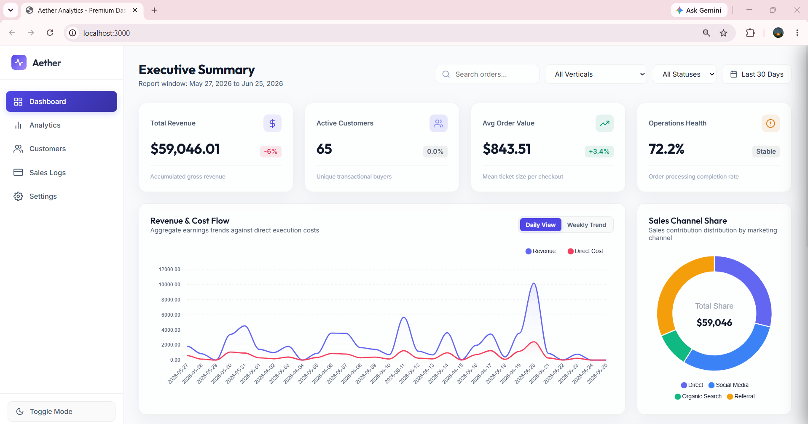
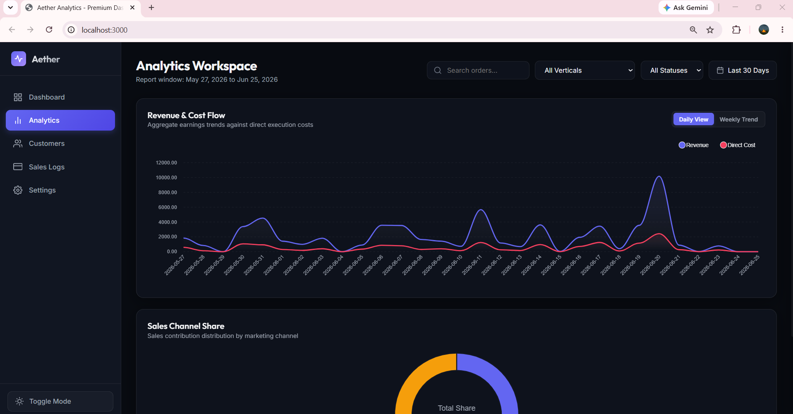
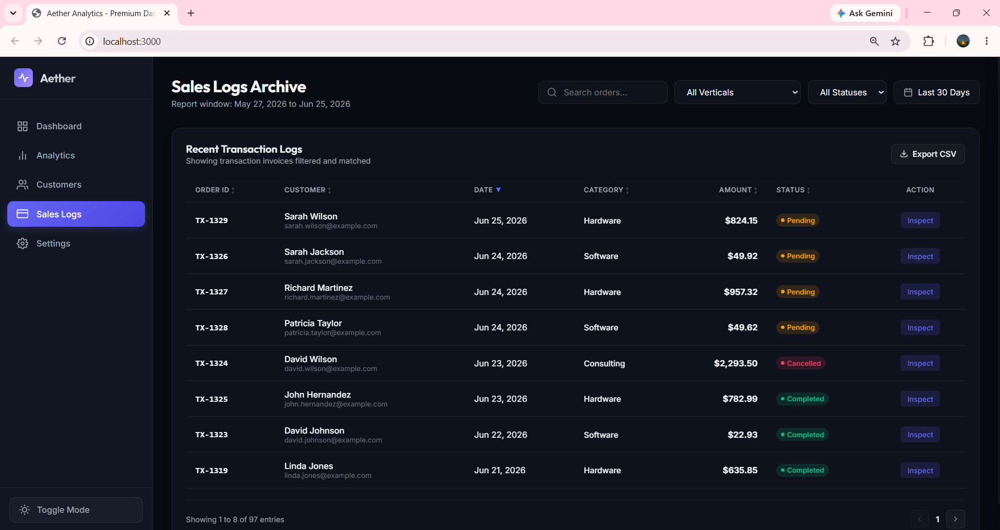
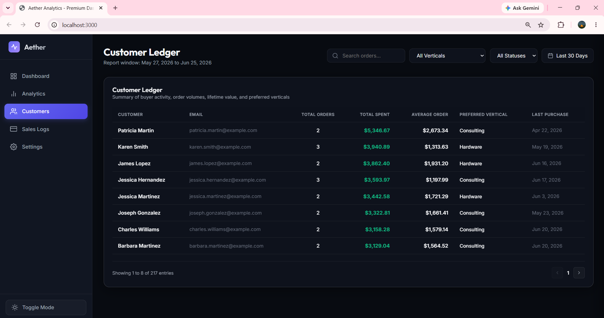
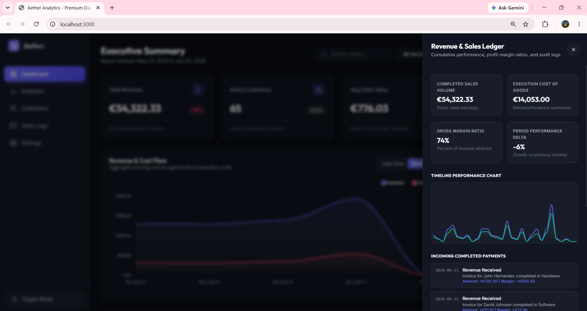
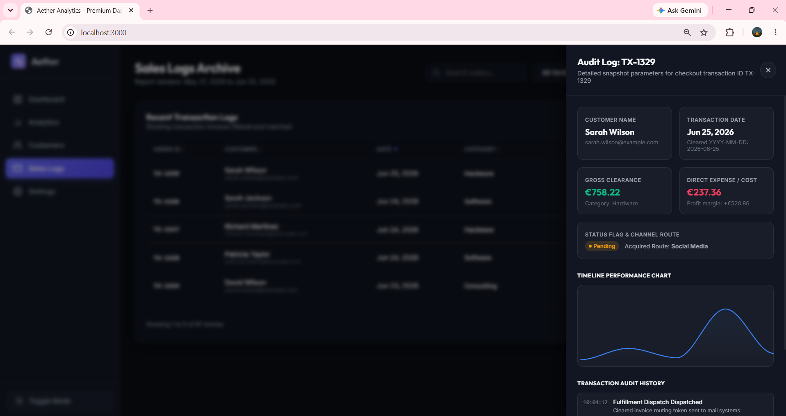
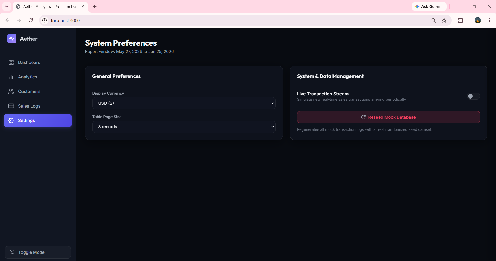
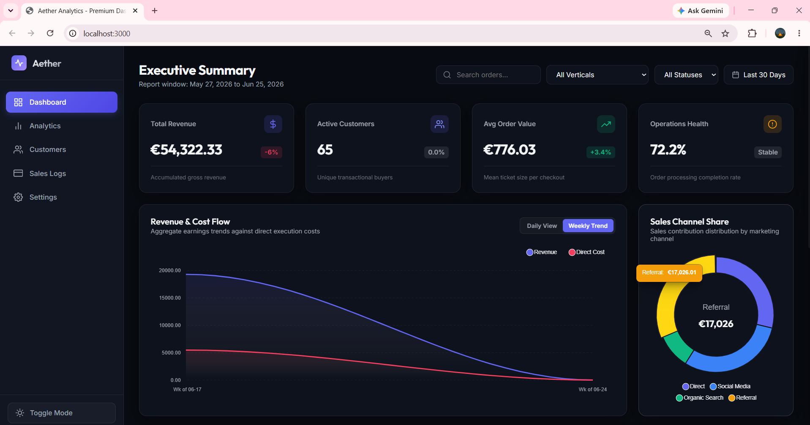
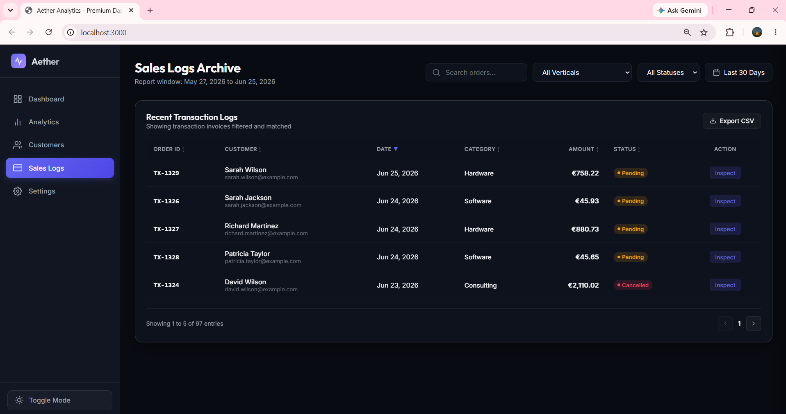

# 🌌 Aether Analytics - Premium Dashboard UI

A premium, highly interactive, and responsive glassmorphic business intelligence analytics dashboard. Engineered with **pure vanilla web technologies** (HTML5, Vanilla CSS, and Modern JavaScript) and integrated with **ApexCharts** for real-time, responsive visualization. 

This interface offers a single-page application (SPA) experience with custom routing, dynamic client-side querying, detailed KPI metrics breakdown drawers, localized currency conversion, and complete theme persistence.

---

## 🎨 Visual Gallery & Interface Walkthrough

Below is a detailed breakdown of the dashboard's features, organized along with verification screenshots from the live application.

### 🌓 Theme Switcher (Dark & Light Mode)
The interface features a robust toggle-based theme switcher. Switching modes updates the dashboard's global styles, gradients, glassmorphic filters, and chart theme tokens (grid line visibility, text color, and tooltip fills) instantly. Theme state is saved to `localStorage` for session persistence.

| 🌙 Dark Mode Overview | ☀️ Light Mode Overview |
| :---: | :---: |
|  |  |

---

### 📊 Views & SPA Navigation
The navigation panel supports seamless tab routing, dynamically detaching and appending components to maximize structural reuse and layout optimization across different workspace contexts.

| 📈 Analytics Workspace | 📑 Sales Logs Archive |
| :---: | :---: |
|  |  |
| *Charts are detached from the home view and expanded to full-width layouts to optimize analytical focus.* | *Focuses on the global tabular log database with fully-featured search, page-size tuning, and paging controllers.* |

| 👥 Customer Ledger |
| :---: |
|  |
| *Synthesizes purchase patterns, order count, total/average ticket size, category preference, and last transaction date.* |

---

### 🔍 Interactive Drill-Down Drawers
Selecting any of the KPI cards on the dashboard slides out an advanced details drawer populated with real-time audit event streams and micro-charts mapping sub-metric breakdowns.

| 📈 KPI Metric Details Drawer | 🔍 Transaction Audit Detail Stream |
| :---: | :---: |
|  |  |
| *Drilling down into Conversion rates shows average ticket sizes, cart abandonment, checkout authentication failures, and funnel health.* | *Opening a transaction item reveals its lifecycle audit history, stripe token verification timestamps, and dispatch logs.* |

---

### ⚙️ Preference Settings & Verifications
The settings console provides a workspace configuration center. Preferences dynamically recalculate values across the entire application interface in real-time.

| ⚙️ General & System Settings Console |
| :---: |
|  |
| *Adjust base currencies, customize table pagination sizes, toggle real-time transaction streaming, or reseed the mock database.* |

| 💱 Live Currency Conversion | 🔢 Table Page Size Modification |
| :---: | :---: |
|  |  |
| *Switching display currency (USD, EUR, GBP) recalculates all monetary numbers (KPIs, tables, averages, chart lines) on-the-fly.* | *Tuning page sizes dynamically rebuilds tables, adjusts pagination counts, and shifts active indices.* |

---

## 🚀 Key Features

- 💎 **Premium Glassmorphic Design:** Sleek translucent panels with backdrop filters, subtle micro-interactions, responsive sizing, and modern typography (using Google Fonts' *Outfit* & *Inter*).
- 🧠 **Client-Side Seeded Database:** Implements a localized random database engine (`js/data.js`) generating consistent, multi-category, 90-day transaction history with reproducible seeded inputs.
- ⚡ **Interactive Charting Engines:** Employs **ApexCharts** to plot dual-axis area graphs (Revenue & Cost Flow trends) and marketing channels distributions (Sales Channel Share doughnut chart).
- 🔄 **State Synchronization:** Live updates triggered via status categories, dates range presets, search terms, and general settings are instantly broadcasted to charts, tables, and KPI cards.
- 📬 **Drill-In Details Drawer:** Slide-out panel container offering specific audit details, mini performance timelines, and transactional logs matching user intent.
- 🌐 **Responsive SPA Routing:** Leverages dynamic DOM manipulation to swap context screens instantly without performance overhead.
- ☁️ **Real-Time Simulation:** Includes a togglable stream generating virtual transactions in the background to simulate dashboard activity.

---

## 🛠️ Tech Stack & Architecture

- **Structure:** [HTML5](index.html) (Semantic components layout with clean separation of views).
- **Styling:** Custom CSS3 with custom variables mapping light/dark tokens ([css/style.css](css/style.css)).
- **Business Logic:** Vanilla ES6+ JS ([js/app.js](js/app.js)) driving state management, inputs filtering, and SPA DOM swapping.
- **Data Engine:** Seeded JSON-Generator Layer ([js/data.js](js/data.js)) handling mock DB queries, totals, averages, and trend comparisons.
- **Charts Integration:** Custom visual manager wrapper ([js/charts.js](js/charts.js)) coordinating live ApexCharts updates and color adjustments.

---

## 🏃 Run the Application Locally

Follow these quick commands to spin up the dashboard locally:

### Prerequisites
Make sure you have [Node.js](https://nodejs.org/) installed.

### Setup and Start
1. **Clone the Repository:**
   ```bash
   git clone https://github.com/mariammgamall/syntecxhub-ui-ux-design-internship.git
   cd syntecxhub-ui-ux-design-internship/Project3-Dashboard-UI
   ```

2. **Start the Development Server:**
   This project uses a quick zero-config static server script predefined in `package.json`. Run the following command:
   ```bash
   npm run dev
   ```
   *This command automatically spins up the `serve` dependency using `npx -y` on port `3000`.*

3. **Open the Dashboard:**
   Visit [http://localhost:3000](http://localhost:3000) in your web browser.
