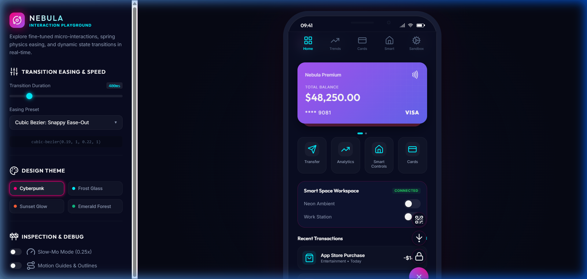
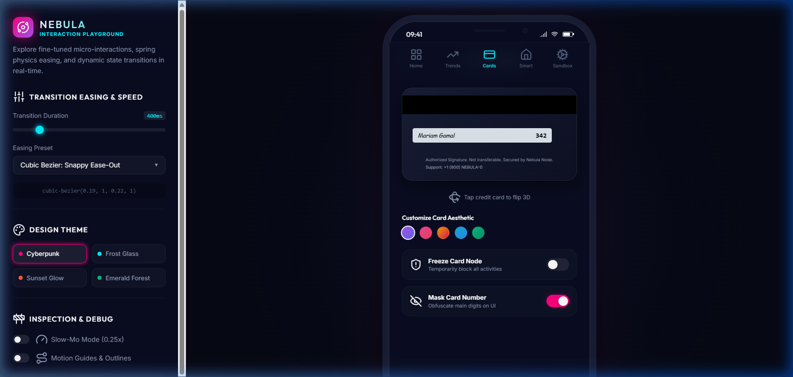
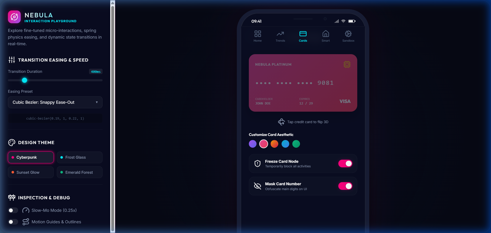
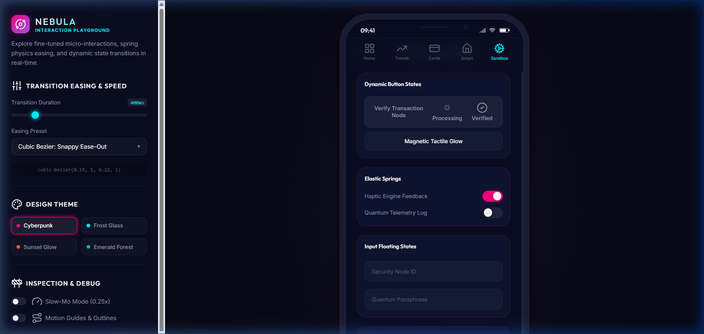
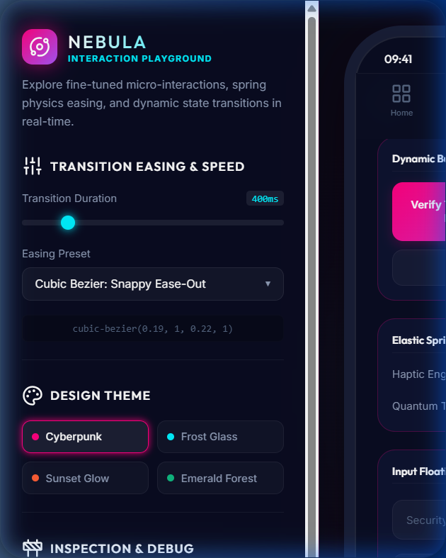

# 🌌 Nebula Pay & Smart Space — Advanced Interactive UI Showcase

An ultra-premium, high-fidelity **UX/UI Interactive Prototyping Showcase & Playground** named **Nebula Pay & Smart Space**. Built as a self-contained Single Page Application (SPA), this project serves as a portfolio-ready demonstration of fine-tuned micro-interactions, 3D CSS transforms, custom timing easing curves, dynamic SVG path morphs, and theme systems.

The interface is presented inside a **Showcase Web Frame** where you can dynamically adjust the animation physics, modify themes, enable diagnostic outline guides, and export spec sheets in real-time.

---

## 🛠️ Showcase Viewports & Interactive Screens

### 1. Biometric Login Screen & Entry Gate
The viewport boots into a presentation canvas wrapping a floating bezel-less mobile device mockup on the right and a debugging control console on the left.
- **Biometric Scan**: Click the Face ID scanner icon to initiate a 1.5-second scanning sequence (rotating glow, laser sweep). On success, it displays a green checkmark and automatically triggers a smooth page transition into the dashboard.
- **Keypad PIN**: Click numbers on the numeric pad to fill PIN code dots with glowing spring pop-ins.

| Biometric Scanner Login View |
| :---: |
|  |

---

### 2. Cyber Finance Dashboard
The main app interface demonstrating stacked layouts, carousels, and staggered menus.
- **Wealth Card Deck Carousel**: Click the card at the back of the deck to rotate and swap card coordinates (scaling down the inactive card and sliding the active card to the front with 3D translations).
- **Staggered Floating Actions Menu (+)**: Tap the floating action button in the bottom right. The core button rotates 135 degrees while sub-options pop up sequentially using staggered transition delays.
- **Toggle Switches**: Bullet bulb switches with spring squash-and-stretch handles that trigger dynamic Toast alerts.

| Active Dashboard Overview | Floating Action Menu Open |
| :---: | :---: |
|  |  |

---

### Screen 3: Credit Card Manager
A card administration portal focused on 3D perspective animations.
- **3D Flip Card**: Click the credit card to trigger a smooth Y-axis 3D rotation, flipping the card 180 degrees to reveal CVV credentials and signature bands on the back.
- **Gradient Aesthetic Selector**: Tap color bubbles to swap CSS gradient variables on the card face in real-time.
- **Privacy Obfuscation (Mask Toggle)**: Toggle security mask settings to swap credit numbers between masked (`••••`) and raw digits instantly.
- **Freeze Node**: Dim the card panel opacity with overlay states when frozen.

| 3D Flipped Card Back CVV Details | Color Theme Swapping | Frozen Card Node Overlay |
| :---: | :---: | :---: |
|  |  |  |

---

### Screen 4: Advanced SVG Analytics (Spendings Chart)
A spendings summary chart demonstrating native browser SVG path-interpolation.
- **Dynamic Path Morphing**: Clicking filter tags (Weekly, Monthly, Yearly) morphs the SVG `<path>` smoothly between datasets.
- **Data Points & Tooltips**: Floating glow points trigger custom HTML tooltip callouts positioned dynamically via JS relative layout math.

| Spendings Analytics & SVG Trends Chart |
| :---: |
|  |

---

### Screen 5: Smart Space Workspace Controls
Smart environment automation with audio feedback and brightness range controls.
- **Luminance Range Slider**: Drag the lighting level range bar to update numeric text indicators and scale the brightness blur glow around the lightbulb.
- **Spinning Vinyl Media Player**: Pressing the play button activates a continuous CSS spin rotation on the record disc. Pausing decelerates the rotation.
- **Bouncing Audio Equalizer**: Eight visual wave columns scale up and down with staggered keyframe durations while playing.

| Smart Bulb Dimmer & Vinyl Audio Player |
| :---: |
|  |

---

### Screen 6: Interactive Component Sandbox
A sandbox showcasing isolated UI interactions.
- **Verify Transaction Button**: Click the button to trigger a multi-phase state machine: *Idle -> Loading (Loader spin) -> Success (Checkmark drawing) -> Automatic reset*.
- **Magnetic Tactile Glow**: Move the mouse cursor over the button to let the button gently hover/translate toward your cursor while updating inline radial gradients.
- **Toast Stack**: Click spawner nodes to emit spring-in custom notifications stacked on the screen.

| Component Sandbox Loading State | Sandbox Success Verification State | Responsive Guidelines Layout |
| :---: | :---: | :---: |
|  |  |  |

---

## ⚙️ Sidebar Presentation Console

- **Timing Easing Preset Dropdown**: Switch between *Spring Elastic*, *Soft Anticipate*, *Snappy Ease-Out*, *Smooth Ease-InOut*, or *Linear* timing curves.
- **Duration Speed Slider**: Range-slider from `100ms` to `2000ms` updating CSS transition durations in real-time.
- **Theme Color Customizer**: Switch the canvas theme classes between **Cyberpunk** (Neon Accents), **Frost Glass** (Frosted Slate), **Sunset Glow** (Amber Gradients), and **Emerald Forest** (Teal Highlights).
- **Debugger Mode Checkbox**: Toggle outline overlays and motion trails to trace item alignments and debug animations in slow-motion (`0.25x` speed).
- **Portfolio Exporter Button**: Generates dynamic log diagnostics and triggers a local file download of the showcase JSON specifications.

---

## 🚀 How to Run Locally

Since this prototype is built entirely using vanilla technologies, it can be launched directly in any web browser without build processes.

### Method 1: Using Node.js HTTP Server (Recommended)
To run a local web server (to handle browser modules and icon assets correctly), execute the following in your terminal:
```bash
# Serve files from root directory
npx http-server -p 8080
```
Open `http://localhost:8080` in your web browser.

### Method 2: Open HTML File
Alternatively, double-click the `index.html` file in your workspace to run the prototype directly.

---

## 📂 File Architecture

- [index.html](index.html) - Structural framework containing the presentation widgets, layouts, device frames, and SVGs.
- [style.css](style.css) - CSS properties design tokens, glassmorphism templates, 3D rotators, animations keyframes, and theme overrides.
- [app.js](app.js) - Router event listeners, biometric scan simulations, active switches, range slider bindings, SVG chart transitions, magnetic button physics, and custom toast notifications.
