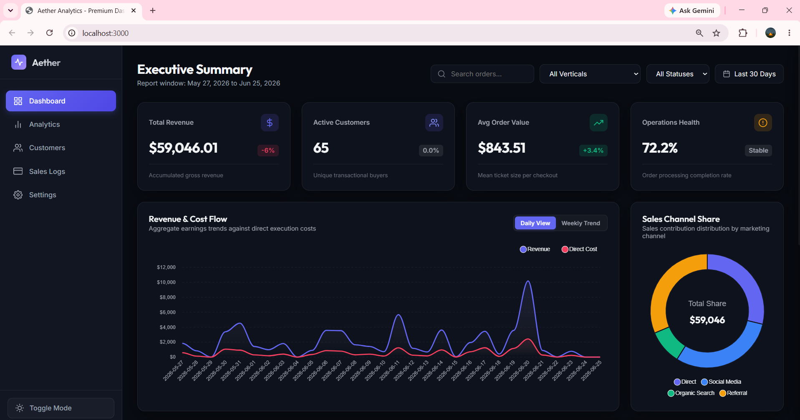
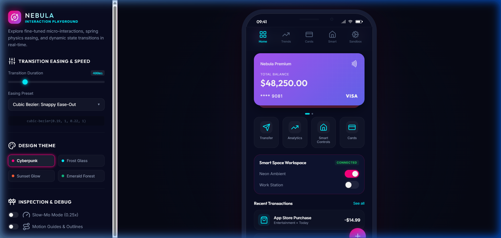
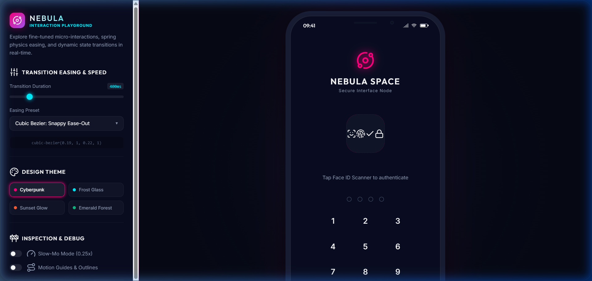
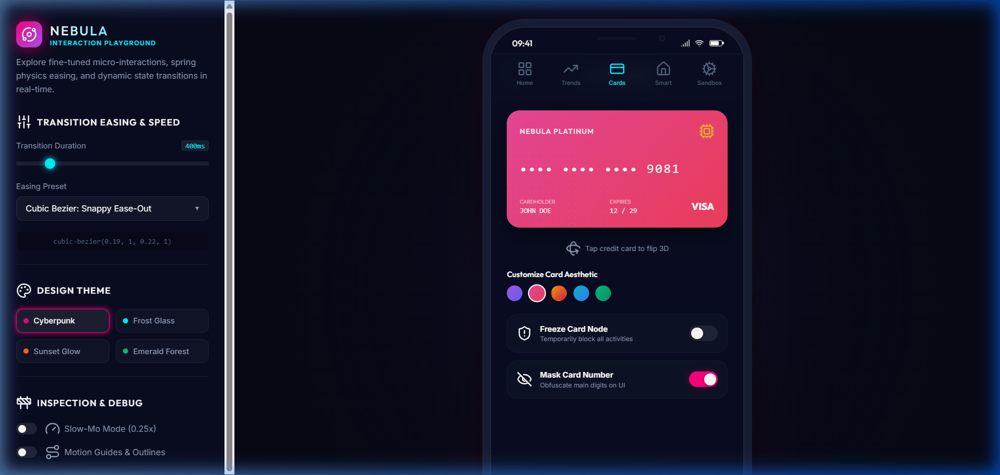
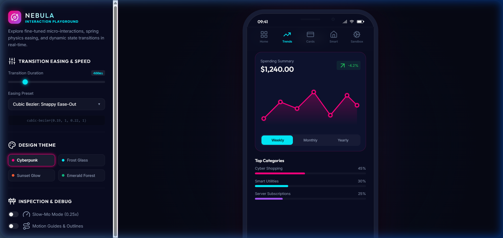
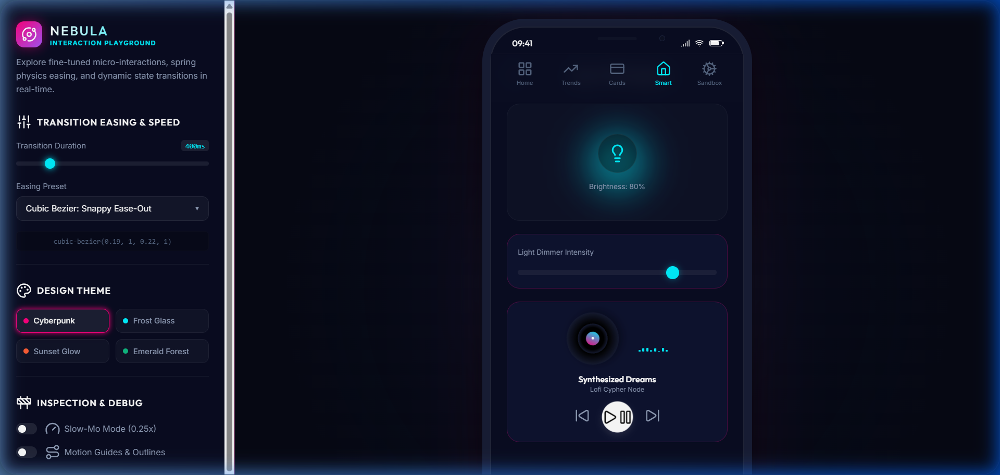
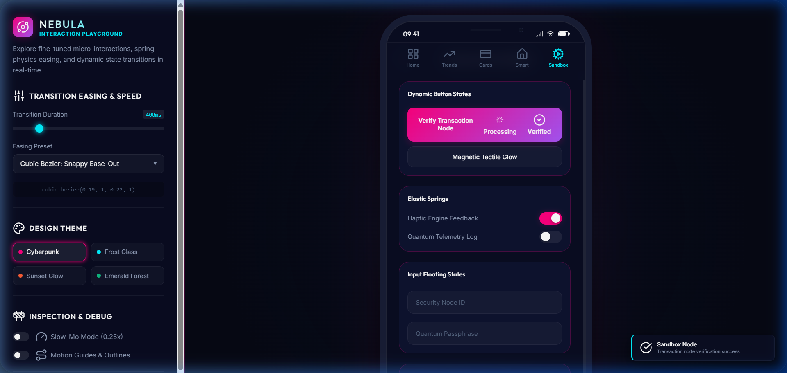

# SyntecxHub UI/UX & Frontend Design Internship Portfolio

Welcome to my frontend engineering and UI/UX design internship repository. This workspace hosts four high-fidelity, interactive projects that bridge the gap between design handoffs (like Figma) and pixel-perfect, interactive frontend implementations.

Each project is built using **Vanilla HTML5, CSS3, and JavaScript** to showcase core programming skills, clean CSS architectures, state machines, and micro-animations without relying on heavy external frameworks.

---

## 📂 Repository Projects Overview

| Project | Key Concepts | Live Link |
| :--- | :--- | :--- |
| **Project 1: Apex SaaS Landing Page & Design Spec Workspace** | Viewport simulator, layout grids, box-model spec calculator, runtime RGB-to-Hex translation, copy-ready code blocks, form validation. | [View Project 1 Directory](./Project1-Design-Landing-Page/) |
| **Project 2: Zenith ANC Headphones E-Commerce Product Details** | E-commerce layout, Smart Animate overlay (300ms ease-out), sequential cart micro-interactions, Figma component property inspector, sidebar collapse. | [View Project 2 Directory](./Project2-E-Commerce-Product-Details-Page/) |
| **Project 3: Aether Analytics Premium Dashboard UI** | Glassmorphic design, SPA navigation/views, interactive ApexCharts, client-side seeded database, KPI details drawer, settings and currency converter. | [View Project 3 Directory](./Project3-Dashboard-UI/) |
| **Project 4: Nebula Pay & Smart Space Interactive Prototype** | Bezel-less mobile mockup, biometric scan sequence, 3D card deck carousel, staggered action menu (+), 3D flip card, path-morphing SVG chart, environment widgets, haptic interactive sandbox. | [View Project 4 Directory](./Project4-Advanced-Interactive-Prototype/) |

---

## 💻 Project 1: Apex — Design Handoff & Spec Workspace

**Apex** is an interactive Design Spec Workspace and living Component Library built for a SaaS Landing Page. It features a fully interactive preview canvas, simulating a Figma-like editor where developers can click and hover on elements to measure spacings and inspect metrics in real time.

### Key Features
*   **Viewport Simulator**: Scales the preview container fluidly between **Desktop**, **Tablet (768px)**, and **Mobile (375px)** widths with live dimensions tracking.
*   **Layout Grid Columns**: Toggles an overlay grid (12-column grid system) directly matching Figma layout grids.
*   **Developer Spec Inspector**: Clicking or hovering over any element renders red dashed guide lines showing distances in pixels to its parent borders, while a right-side panel reports box-model dimensions, margins, paddings, gaps, and computed CSS.
*   **Hex Color Clipboard**: Displays active color swatches on the left, automatically translating computed RGB colors into copy-ready Hex strings (`#RRGGBB`) with clipboard copy toast feedback.
*   **CTA Validation Flow**: Validates subscriber emails with custom JS regex, prompting layout error borders or a success popup modal.

### Screenshot Showcase

*Desktop Preview of the Interactive Workspace showing the Spec Canvas*

| Viewport Simulator | CSS Developer Inspector | Custom Success Modal |
| :---: | :---: | :---: |
|  |  |  |

👉 **Open Project 1**: [Project1-Design-Landing-Page/index.html](./Project1-Design-Landing-Page/index.html)

---

## 🎧 Project 2: Zenith ANC Headphones — Interactive Product Details

**Zenith** is a high-fidelity e-commerce Product Detail Page (PDP) designed to demonstrate state transitions, interactive variants, and prominent CTA micro-interactions. It features a responsive layout alongside a simulated **Figma Component Inspector** sidebar.

### Key Features
*   **Smart Animate Image Gallery**: Tapping thumbnails swaps images smoothly. Clicking the main image opens a full-bleed dark blurred overlay mimicking Figma's **Smart Animate** (300ms ease-out).
*   **Interactive Design Variants**: Handles color swatches and size buttons across multiple variants:
    *   *Colors*: Selected (gold active ring and outer glow), Default, and Out of Stock (faded opacity with diagonal line).
    *   *Sizes*: Selected (gold fill and outline), Default, and Disabled (dashed border, muted text, disabled pointer events).
*   **Bi-directional Properties Panel**: Changing variant selections on the PDP updates the Figma Properties Panel dropdowns. Toggling variables (Boolean: On Sale, Text Properties, Instance Swaps) in the panel instantly renders changes on the PDP.
*   **Cart Micro-interaction**: A custom JS state machine controls the CTA: **Default** $\rightarrow$ **Loading** (with spin loader) $\rightarrow$ **Success** (with checkmark icon) $\rightarrow$ **Reverts back**.
*   **Sidebar Toggle**: A header action collapses and slides the Figma Inspector sidebar out of view for a clean storefront screenshot view.

### Screenshot Showcase

*Zenith Headphones Product Details with Figma Inspector Sidebar active*

| Collapsed Storefront View | Image Zoom Overlay | Add to Cart Spinner State |
| :---: | :---: | :---: |
|  |  |  |

👉 **Open Project 2**: [Project2-E-Commerce-Product-Details-Page/index.html](./Project2-E-Commerce-Product-Details-Page/index.html)

---

## 📊 Project 3: Aether Analytics — Premium Dashboard UI

**Aether Analytics** is a premium, highly interactive, and responsive glassmorphic business intelligence analytics dashboard. Engineered with modern vanilla web technologies and integrated with **ApexCharts**, it offers a single-page experience containing custom routing, dynamic client-side querying, detailed KPI metrics breakdown drawers, localized currency conversion, and theme persistence.

### Key Features
*   **Premium Glassmorphic Design**: Sleek translucent panels with backdrop filters, subtle micro-interactions, responsive sizing, and modern typography (*Outfit* & *Inter* fonts).
*   **Seeded Client-Side Database**: A localized data generator creating consistent, multi-category, 90-day transaction history with reproducible seeded inputs.
*   **Interactive Charting Engine**: Integrates ApexCharts to plot dual-axis area graphs (Revenue & Cost trends) and category sales share charts dynamically responding to filters.
*   **Drill-Down Details Drawers**: Selecting any KPI card or transaction audit detail slides out a comprehensive metrics breakdown sheet and transaction log timeline.
*   **Dynamic Settings & Currency Converter**: Allows modifying display currencies (USD, EUR, GBP), table page sizes, database seeding, and real-time transaction streaming, instantly recalculating all values on-the-fly.
*   **SPA Navigation & Table Filtering**: Custom client-side router swaps between Analytics, Sales Logs, and Customer Ledger views, with robust searching, filtering, and paging.

### Screenshot Showcase

*Aether Analytics Premium Dashboard in Dark Mode showing the primary widgets and charts*

| Light Mode Overview | Analytics Workspace | KPI Metric Details Drawer |
| :---: | :---: | :---: |
|  |  |  |

👉 **Open Project 3**: [Project3-Dashboard-UI/index.html](./Project3-Dashboard-UI/index.html)

---

## 🌌 Project 4: Nebula Pay & Smart Space — Advanced Interactive UI Showcase

**Nebula Pay & Smart Space** is an ultra-premium, high-fidelity UX/UI Interactive Prototyping Showcase and Playground. Built as a self-contained Single Page Application (SPA), it serves as a portfolio-ready demonstration of fine-tuned micro-interactions, 3D CSS transforms, custom timing easing curves, dynamic SVG path morphs, and environment automation.

### Key Features
*   **Biometric Login Screen & Entry Gate**: Click the Face ID scanner icon to initiate a 1.5-second scanning sequence (rotating glow, laser sweep). On success, it displays a green checkmark and automatically triggers a smooth page transition.
*   **Cyber Finance Dashboard**: Features a 3D Wealth Card Deck Carousel, a Staggered Floating Actions Menu (+) that rotates 135 degrees, and bullet bulb toggle switches.
*   **Credit Card Manager**: Integrates a 3D flip credit card (revealing CVV details on back Y-axis rotation), gradient aesthetic selector bubbles, and a privacy obfuscation toggle.
*   **Advanced SVG Spendings Chart**: Native browser SVG path-interpolation that morphs paths smoothly between weekly, monthly, and yearly datasets when filter tags are clicked.
*   **Smart Space Workspace**: Controls light dimmer luminance range sliders (with scaling blur glow), vinyl record spin play/pause deceleration, and a haptic huff bouncing audio equalizer.
*   **Interactive Component Sandbox**: Isolated haptic and interactive states like transaction loading-to-success buttons, magnetic tactile glows following cursor translations, and spawning toast notification nodes.

### Screenshot Showcase

*Nebula Pay Home Dashboard inside the high-fidelity bezel-less mobile phone viewport frame*

| Biometric Login Gate | Credit Card Manager | SVG Spendings Chart | Smart Vinyl Media Player | Component Sandbox |
| :---: | :---: | :---: | :---: | :---: |
|  |  |  |  |  |

👉 **Open Project 4**: [Project4-Advanced-Interactive-Prototype/index.html](./Project4-Advanced-Interactive-Prototype/index.html)

---

## ⚙️ How to Run Locally

Since these projects consist of static client-side files, you do not need build steps, bundling, or complex packages. 

### Method 1: Direct File Launch (Easiest)
Navigate into any project folder and double-click the `index.html` file to open and preview the interactive page in your browser directly.

### Method 2: Launch Local HTTP Server
If you want to serve the files over a local web port (e.g. `localhost:8080`), open your terminal in the repository root folder:

**Using Node.js/NPM (Bypassing PowerShell execution policies on Windows):**
```bash
npx.cmd http-server -p 8080
```

**Using Python:**
```bash
python -m http.server 8080
```
Then open `http://localhost:8080` in your web browser and click on any project folder to load it.

### Method 3: NPM Live Server (Project 3 Dedicated)
If you want to run the dedicated dev server for the dashboard project, run:
```bash
cd Project3-Dashboard-UI
npm run dev
```
Then visit [http://localhost:3000](http://localhost:3000).

---

## 🎓 Skills Demonstrated

*   **Semantic HTML5 & DOM Architecture**: Structuring canvas simulators, product screens, and responsive dashboard grids using native DOM elements and semantic layouts.
*   **Modern CSS3 Layouts & Animations**: Creating layout systems using custom properties (variables), flexible box layouts, grid tracks, container queries, backdrop filters, glassmorphic styles, light/dark themes, and keyframe animations.
*   **Vanilla JavaScript State Machines & Routing**: Implementing state transitions, client-side routing, asynchronous event loops, regular expressions, and bi-directional element binding.
*   **Interactive Prototyping**: Replicating complex UI interactions (Smart Animate, collapsibles, custom loaders, slide-out details drawers, modal overlays) based on design specs.
*   **Data Visualization & Seeded Engines**: Implementing interactive charts utilizing ApexCharts, coordinating theme adjustments and real-time updates based on user filters; developing local seed-based database query engines.
